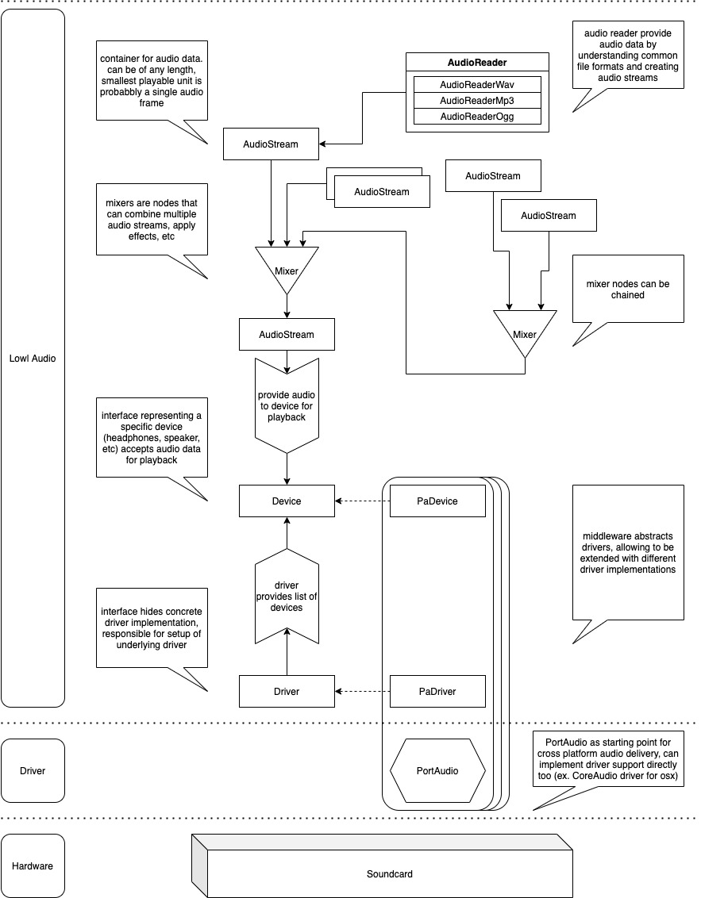

LowL Audio
===
Low Latency Audio - aims to provide audio playback - work in progress

## Disclaimer
- no audio expert
- first time using cmake

## Goal
Providing audio output is quite difficult, one needs to parse sound files, 
process the samples so they can be consumed by the driver and lastly 
implement the audio driver for each platform.

All of these tasks are somewhat solved but I still find it challenging to
put it all together, and in the end a lot of 3rd party libraries impose licenses,
which are not always easy to apply.

The aim of this project is to be the glue between moving parts and provide:
- common audio format parsing
- sample conversation
- playback
- unix/osx/win support
- easy to understand/reason about code
- MIT licensed and only utilize libraries that are compatible with MIT license

As a user of this library I want to be able to play back audio samples, be it generated or from audio files.

## 3rd Party
- [Port Audio](https://github.com/PortAudio/portaudio) - [simplified BSD](https://github.com/cameron314/readerwriterqueue/blob/master/LICENSE.md)
- [readerwriterqueue](https://github.com/cameron314/readerwriterqueue) - [MIT](https://github.com/PortAudio/portaudio/blob/master/LICENSE.txt)

All third party libraries should be compatible with the MIT license,
so that they can be included.
If there is any issue including one of these projects under the MIT license,
please let me know by opening an issue and I will remove it / perform required changes.

## Guidlines

### Header include order:
from local to global, each subsection in alphabetical order, i.e.:
1) h file corresponding to this cpp file (if applicable)
2) headers from the same component
3) headers from other components
4) system headers

## System

created with [draw.io](https://draw.io/)

## TODO
- converter for audio frames (16 bit -> float; etc)
- file format parsing (mp3 / wav / ogg)
- run under win/osx/unix
- c-api wrapper

## Flags
LOWL_LIBRARY  
LOWL_WIN  
LOWL_UNIX  
LOWL_DRIVER_DUMMY  
LOWL_DRIVER_PORTAUDIO

