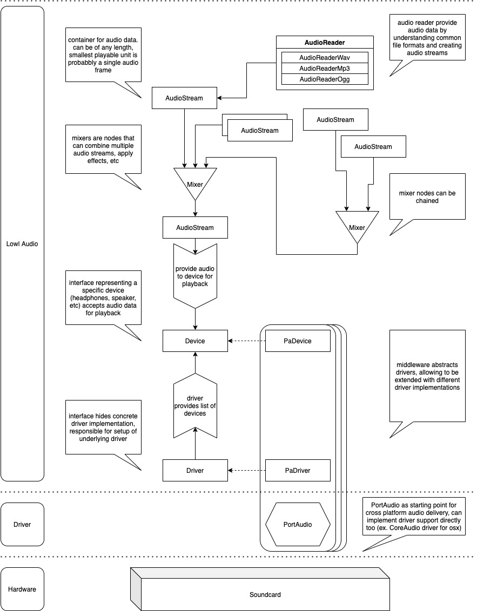

LowL Audio
===
**Low**L**atency **A**udio - Audio Framework / Audio Engine


# TODO
- display list of available output format configurations, ensure that this list is reduced by not implemented outputs, capabilities and dupes.


## Setup
1) `git clone https://github.com/sebastian-heinz/lowl_audio.git`
2) `cd lowl_audio`
3) `git submodule update --init --recursive`

#### Flags
- LOWL_DRIVER_DUMMY - enable dummy driver

## Platforms
- Windows
- macOS

## Audio Formats
- .wav
- .mp3
- .ogg
- .flac
- .opus

## Features
- Audio Playback
- Audio Mixer
- SampleRate converter
- Sample BitDepth converter

---

## Usage
#### iterate drivers and devices
```c++
#include "lowl.h"

#include <iostream>

int main() 
{
    // initialize the library
    Lowl::Error error;
    Lowl::Lib::initialize(error);
    if (error.has_error()) {
        std::cout << "Err: Lowl::initialize\n";
        return -1;
    }

    // query a list of available drivers
    std::vector<std::shared_ptr<Lowl::Driver>> drivers = Lowl::Lib::get_drivers(error);
    if (error.has_error()) {
        std::cout << "Err: Lowl::get_drivers\n";
        return -1;
    }

    std::vector<std::shared_ptr<Lowl::Device>> all_devices = std::vector<std::shared_ptr<Lowl::Device>>();
    int current_device_index = 0;
    // iterate available drivers
    for (std::shared_ptr<Lowl::Driver> driver : drivers) {
        std::cout << "Driver: " + driver->get_name() + "\n";
        
        // driver need to be initialized before device can be queried
        driver->initialize(error);
        if (error.has_error()) {
            std::cout << "Err: driver->initialize (" + driver->get_name() + ")\n";
            error = Lowl::Error();
        }
        
        // iterate all device of a particular driver
        std::vector<std::shared_ptr<Lowl::Device>> devices = driver->get_devices();
        for (std::shared_ptr<Lowl::Device> device : devices) {
            std::cout << "Device[" + std::to_string(current_device_index++) + "]: " + device->get_name() + "\n";
            all_devices.push_back(device);
        }
    }
    
    // select a device
    int selected_index = 0;
    std::cout << "Select Device:\n";
    std::string user_input;
    std::getline(std::cin, user_input);
    selected_index = std::stoi(user_input);
    
    std::shared_ptr<Lowl::Device> device = all_devices[selected_index];
}
```
---
#### load audio file
```c++
#include "lowl.h"

#include <iostream>

int main() 
{
    std::shared_ptr<Lowl::AudioData> data = Lowl::Lib::create_data("/Users/name/Downloads/music.wav", error);
    if (error.has_error()) {
        std::cout << "Err:  Lowl::create_stream\n";
        return -1;
    }
}
```
---
#### audio playback
```c++
#include "lowl.h"

#include <iostream>
#include <thread>

int main() 
{
    std::shared_ptr<Lowl::Device> device = .... (refer to: iterate drivers and devices)
    std::shared_ptr<Lowl::AudioData> data = ... (refer to: load audio file)
    
    device->start(data, error);
    if (error.has_error()) {
        std::cout << "Err: device->start\n";
        return -1;
    }

    // wait till all frames have been played
    while (data->frames_remaining() > 0) {
        std::this_thread::sleep_for(std::chrono::milliseconds(1000));
        std::cout << "==PLAYING==\n";
        std::cout << "frames remaining: \n" + std::to_string(data->frames_remaining()) + "\n";
    }
}
```
---
#### audio mixer
```c++
#include "lowl.h"

#include <iostream>
#include <thread>

int main() 
{
    std::shared_ptr<Lowl::Device> device = ...... (refer to: iterate drivers and devices)
    std::shared_ptr<Lowl::AudioData> data_1 = ... (refer to: load audio file)
    std::shared_ptr<Lowl::AudioData> data_2 = ... (refer to: load audio file)
            
    std::shared_ptr<Lowl::AudioMixer> mixer = std::make_unique<Lowl::AudioMixer>(
            data_1->get_sample_rate(), data_1->get_channel()
    );
    
    // add data to the mixer
    // note: data can be added to the mixer at any point in time.
    // for example the device could be started first, then
    // data_1 can be mixed in after 1 second and data_2 after 40 seconds for example.
    mixer->mix_data(data_1);
    mixer->mix_data(data_2);

    // start the device
    device->start(data, error);
    if (error.has_error()) {
        std::cout << "Err: device->start\n";
        return -1;
    }

    // wait till all frames have been played
    while (data->frames_remaining() > 0) {
        std::this_thread::sleep_for(std::chrono::milliseconds(1000));
        std::cout << "==PLAYING==\n";
        std::cout << "frames remaining: \n" + std::to_string(data->frames_remaining()) + "\n";
    }
}
```
---
#### lowl space
```c++
#include "lowl.h"

#include <iostream>

int main() 
{
    auto space = std::make_shared<Lowl::Audio::AudioSpace>(
        44100.0,
        Lowl::Audio::AudioChannel::Stereo
    );

    Lowl::Error error;

    Lowl::AudioAssetHandle asset_handle = space->add_audio(
        "/Users/railgun/Downloads/CantinaBand60.wav",
        error
    );
    if (error.has_error() || !asset_handle.is_valid()) {
        std::cout << "Err: space->add_audio\n";
        return -1;
    }

    Lowl::AudioPlaybackHandle playback_handle = space->create_playback(asset_handle);
    if (!playback_handle.is_valid()) {
        std::cout << "Err: space->create_playback\n";
        return -1;
    }

    // `play()` always starts the playback from frame 0.
    space->play(playback_handle);

    // playback controls operate on the playback handle, not the asset handle.
    space->set_volume(playback_handle, 0.5f);
    space->set_panning(playback_handle, -0.25f);
    space->pause(playback_handle);
    space->resume(playback_handle);

    // `stop()` pauses and resets the playback to frame 0.
    space->stop(playback_handle);
}
```
---
#### configure logging
```c++
#include "lowl.h"

int main() 
{
    // set desired log level
    Lowl::Logger::set_log_level(Lowl::Logger::Level::Debug);
    // write logs to std::cout
    Lowl::Logger::register_std_out_log_receiver();
}
```
---
#### configure custom log receiver
```c++
#include "lowl.h"

void std_out_log_receiver(Logger::Level p_level, const char *p_message, void *p_user_data) {
    // handle logs
    std::cout << p_message;
}

void main()
{
    // calls std_out_log_receiver for handling logs
    register_log_receiver(&std_out_log_receiver, nullptr);
}
```

---

## Requirements
- all operations are performed over float32 samples
  - input files via the `AudioReader` are converted to float32 sample data
  - generated or streamed audio data should be provided as float32 samples

## Info
- Pa+Win: if the sample rate of `AudioSource` that is passed to `LowlDevice` does not match the devices sample rate, it will not open the stream.

## Definitions
- Audio Sample = smallest audio unit, depends on bit depth
- Audio Frame = one time slice across all channels

## System

created with [draw.io](https://draw.io/)

---

## 3rd Party
- [Port Audio](https://github.com/PortAudio/portaudio)
  - License: [MIT](https://github.com/PortAudio/portaudio/blob/master/LICENSE.txt)
  - portable audio I/O library designed for cross-platform support of audio.
- [readerwriterqueue](https://github.com/cameron314/readerwriterqueue) & [concurrentqueue](https://github.com/cameron314/concurrentqueue)
  - License: [simplified BSD](https://github.com/cameron314/readerwriterqueue/blob/master/LICENSE.md)
  - [Blog Post](https://moodycamel.com/blog/2013/a-fast-lock-free-queue-for-c++.htm) describing the queue is designed for audio sample transfer
  - industrial-strength lock-free queue for C++
- [dr_libs](https://github.com/mackron/dr_libs)
  - License: [Choice of public domain or MIT-0](https://github.com/mackron/dr_libs/blob/46f149034a9f27e873d2c4c6e6a34ae4823a2d8d/dr_wav.h#L6363)
  - audio decoding libraries
- [r8brain-free-src](https://github.com/avaneev/r8brain-free-src)
  - License: [MIT](https://github.com/avaneev/r8brain-free-src/blob/master/LICENSE)
  - high-quality professional audio sample rate converter
- [doctest](https://github.com/onqtam/doctest)
  - License: [MIT](https://github.com/onqtam/doctest/blob/master/LICENSE.txt)
  - C++ testing framework
- [ogg](https://github.com/xiph/ogg)
  - License: [MIT](https://github.com/onqtam/doctest/blob/master/LICENSE.txt)
  - C++ testing framework
- [ogg](https://github.com/xiph/ogg)
  - License: [BSD-3-Clause license](https://github.com/xiph/ogg/blob/master/COPYING)
  - Ogg project codecs use the Ogg bitstream format to arrange the raw, compressed bitstream into a more robust, useful form
- [vorbis](https://github.com/xiph/vorbis)
  - License: [BSD-3-Clause license](https://github.com/xiph/vorbis/blob/master/COPYING)
  - General purpose audio and music encoding format
- [opus](https://github.com/xiph/opus)
  - License: [BSD-3-Clause license](https://github.com/xiph/opus/blob/master/COPYING)
  - Opus is a codec for interactive speech and audio transmission over the Internet
- [opusfile](https://github.com/xiph/opusfile)
  - License: [BSD-3-Clause license](https://github.com/xiph/opusfile/blob/master/COPYING)
  - The opusfile and opusurl libraries provide a high-level API for decoding and seeking within .opus files on disk or over http(s).


---

## License
All third party libraries come with own licenses and terms.
You can find the respective license in the 3rd parties directory.
For convenience the specific license for each project that is used can be found in the above link collection.
However all 3rd party dependencies have been chosen to be as friendly as possible and in all cases retaining the
license text / copyright notice when distributing them in source or binary form will have you covered.

This project itself is licensed under the MIT license, that includes the .h and .cpp files, except for the content
in the `third_party`-directory.

---

## Links
a list of related information to audio programming

- [real time audio programming 101](http://www.rossbencina.com/code/real-time-audio-programming-101-time-waits-for-nothing)
- [int float int its jungle out there](http://blog.bjornroche.com/2009/12/int-float-int-its-jungle-out-there.html)
- [linearity and dynamic range in int](http://blog.bjornroche.com/2009/12/linearity-and-dynamic-range-in-int.html)
- [Audio recording bitdepth](https://lists.apple.com/archives/coreaudio-api/2009/Dec/msg00046.html)
- [CppCon 2015: Timur Doumler “C++ in the Audio Industry”](https://www.youtube.com/watch?v=boPEO2auJj4)
---
